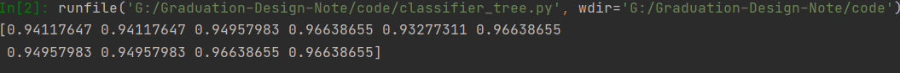
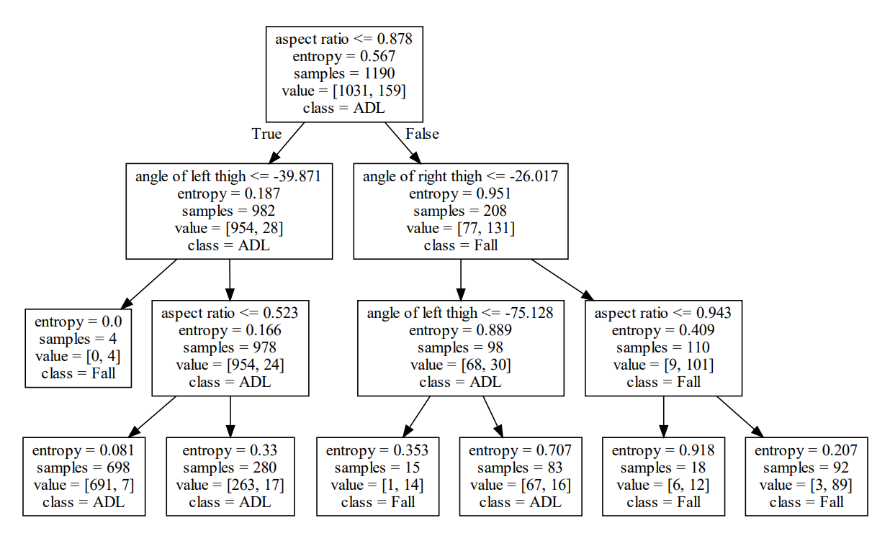
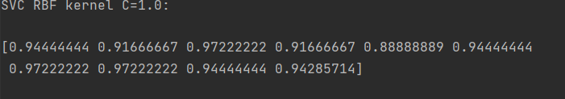
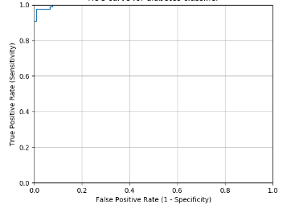

# 毕设笔记(2021/1/31)
## 目前进度
### 文献综述
已经完成对于目前各种研究方法的介绍，目前草稿见附件
### 毕设实验
由于原来选定的UR数据集有较大部分会出现特征点识别严重缺失的问题(由于其镜头位置在地面上，人倒下后会有一多半的身体位于画面外)，更换数据集为Fall Detcetion Dataset(http://falldataset.com/), 提出该数据集的论文见附件。由于机器原因，目前只使用一小部分做了实验(ADL 1031条数据 Fall 159条数据)，返校后再使用全部数据实验。目前在两个模型上做了实验。
目前实验效果很好，如下：
- 决策树
决策树的数据向量包括三个元素：人躯干长宽比，左膝盖与脖子连线的角度，右膝盖与脖子连线的角度。
在目前的数据集上，10折交叉评分(f1 score, precision 和 recall的调和平均值)如下图:

可视化决策树如下图：

- SVM（高斯核）
目前的数据是这样，以右大腿的长度l的倒数为正则化系数，以脖子关键点为原点，对坐标正则化。选取脖子，左右肩， 左右臀， 左右膝七个关键点坐标作为特征。
10折交叉评分如下：

ROC曲线如下：

这个数据已经超过提出该数据集的论文的效果了。
## 下一步计划
### 综述
撰写目前fall detection领域通用的模型评价方式（混淆矩阵，ROC曲线等等）
### 实验
尝试其它normalize方法得到的数据，选取其它关键点作为特征输入模型。
另外，我在阅读文献时发现有的研究者采用SVDD或one class SVM，对数据进行训练，并使用离群点检测来判断跌倒(因为数据集不平衡，ADL数据远多于fall)。我准备尝试一下。
总之，争取在寒假把实验的workflow都搭建好，返校后增大数据量跑出结果。

## 目前的问题
- 综述中对于模型评价方式的介绍是否应该引用文献？
- 如果引用，是引用提出评价方式的文献还是使用该评价方式的文献？
- 这些评价方式都是广泛使用的，也就是说，使用同一评价方式的文献非常多，如果引用该如何选取引用的文献？