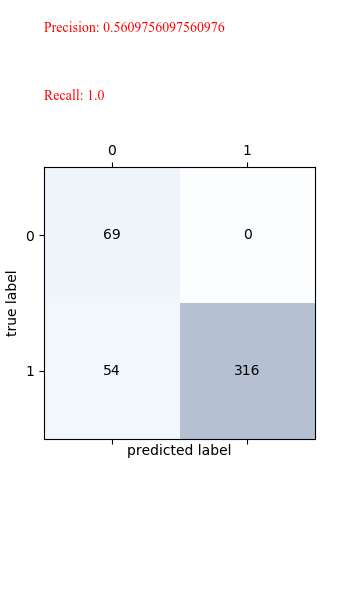

# 毕设笔记(2021/2/6)
## 目前进度
### 文献综述
介绍了recall, precision等等指标，还没写roc曲线。
### 毕设实验
我重新生成了一个小的测试集，这个测试集与训练集拍摄角度不完全相同，房间不同，实验者不同。总而言之，这是一个更加严谨的测试集。训练了一些模型，效果如下：
- SVM系列：
roc曲线：

其中效果最好的基于大腿长度normalize的混淆矩阵以及recall, precision：

- 离群点系列：
实验了OCSVM, 隔离森林，椭圆模型拟合，效果均不如SVM。
在测试集上的混淆矩阵如下：
OCSVM：

隔离森林：

椭圆模型拟合：

## 下一步计划
### 综述
继续阅读文献，如果有新的想法继续修改综述
### 实验
还有一些离群点检测模型没有实验，准备继续进行。
## 目前的问题
暂时没有什么问题，老师对于目前的实验结果有什么评价呢？
